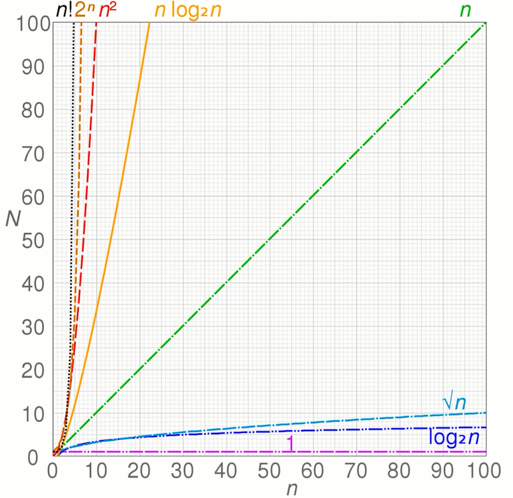

## 时间复杂度
- 定义
  - 一个函数，用 O 表示
  - 定性描述该算法的运行时间

- 
  - O(1)
    ```js
    let i = 0;
    i += 1;
    ```
  - O(n)
    ```js
    for(let i =0; i < n; i += 1) {
      console.log(i);
    }
    ```
  - O(logN)
    ```js
    let i = 1;
    while (i < n) {
      console.log(i);
      i *= 2;
    }
    ```
  - O(1) + O(n) = O(n) 取最大的值
  - O(n) * O(n) = O(n^2)

## 空间复杂度
- 定义
  - 一个函数，用 O 表示
  - 描述算法在运行过程中临时占用存储控件大小的量度
- O(1)
    ```js
    let i = 0;
    i += 1;
    ```
- O(n)
  ```js
  const list = [];
  for(let i = 0; i < n; i+= 1) {
    list.push(i)
  }
  ```
- O(n^2) 
  ```js
  // 类似一个矩阵
  const matrix = [];
  for(let i = 0; i < n; i += 1) {
    matrix.push([]);
    for(let j = 0; j < n; j += 1>) {
      matrix[i].push(j)
    }
  }
  ```