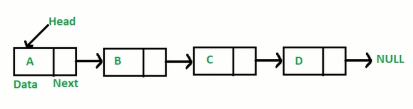

## 链表
- 定义
  - 多个元素组成的列表
  - 元素存储不连续，用 next 指针连成一起
  -  
- 数组 VS 链表
  - 数组增删非首尾元素时需要移动元素
  - 链表增删非收尾元素，不需要移动元素，只需要更改 next 的指向即可
- 用 Object 来模拟
```js
const a = { val: 'a' };
const b = { val: 'b' };
const c = { val: 'c' };
const d = { val: 'd' };

a.next = b;
b.next = c;
c.next = d;

// 遍历链表
let p = a; // 新增一个指针
while (p) {
  console.log(p.val);
  p = p.next;
}

// 插入
const e = { val: 'e' };
// 把 e 插到 d 前面
c.next = e;
e.next = d;

// 删除
c.next = d;

```
- 应用场景
  - 删除链表中的节点
    - https://leetcode-cn.com/problems/delete-node-in-a-linked-list/
    - 无法直接获取被删除节点的上个节点
    -思路
      - 将被删除节点的值转改为下个节点的值
      - 删除下个节点
  - 反转一个单链表
    - https://leetcode-cn.com/problems/reverse-linked-list/
    - 反转两个节点：将 n+1 的 next 指向 n
    - 反转多个节点：双指针遍历链表
    - 思路
      - 双指针一前一后遍历链表
      - 反转双指针
  - 两数相加
    - https://leetcode-cn.com/problems/add-two-numbers/
    - 思路
      - 新建一个空链表
        - new ListNode(0)
      - 遍历被相加的两个链表，模拟相加操作，将个位数追加到新链表上，将十位数留在下一位去相加